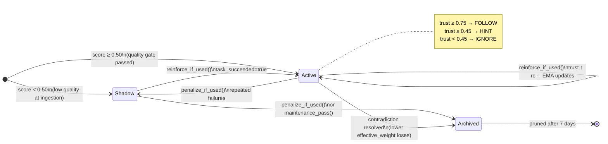
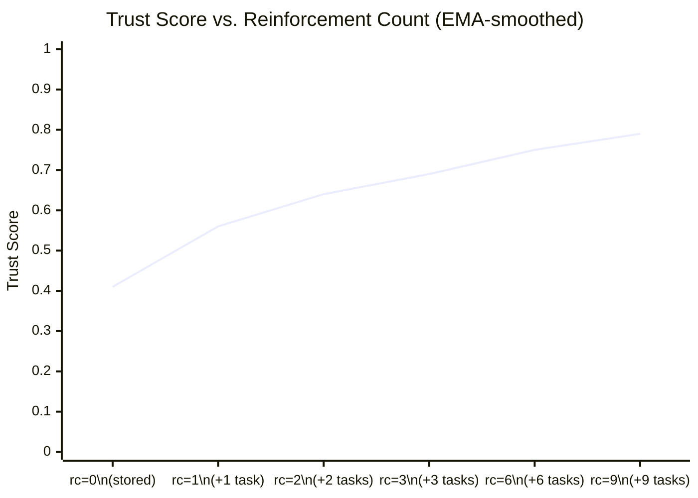

# Memoire

> **Local-first semantic memory engine for AI coding agents.**  
> It doesn't just remember — it decides what deserves to be remembered, trusted, and forgotten.

[](LICENSE)
[](https://github.com/tazwaryayyyy/Memorie-AI/actions)

---

## The Mistake That Keeps Happening

```
Task 1: "Implement tax computation for billing."
  Agent: amount = float(9.99)          # ← float money bug
  Tests: FAIL

Task 2: "Implement discount and refund computation."  
  Agent: amount = float(19.99)         # ← same bug, different task
  Tests: FAIL

With no memory: the agent has learned nothing.
```

```
With Memoire:

Task 1: FAIL → lesson stored.
  [RECALL]  "Never use float for money. Use Decimal..."
             score=0.84 | trust=0.41 | action=HINT

Task 2: Agent receives injected context.
  [RESULT]  from decimal import Decimal
            amount = Decimal('19.99')
  Tests: PASS → memory reinforced → trust=0.56
```

The difference is not retrieval. Every vector store retrieves. The difference is that Memoire scored the lesson as worth keeping, ranked it by trust when recalled, decided the agent should act on it, and reinforced it only because the agent actually used it correctly.

---

## What This Is

Most agent memory systems are retrieval systems with a database behind them. You write in, you read out, you hope the cosine score is good enough.

Memoire is a **self-correcting memory layer**. Every piece of information that enters has to earn its place — scored on actionability, consequence, novelty, and evidence at ingestion time. Every piece that comes back carries a **trust score** that tells the agent not just *what* is similar, but *how confident it should be acting on it*, alongside an **uncertainty value** that signals when a memory is contested or under-reinforced. Reinforcement only fires when memory was actually used to produce a successful outcome. Wrong memories are penalized proportionally to how bad the failure was, causing trust to decay organically. Contradicting memories resolve against each other and the loser is archived. The whole thing runs in a single `.db` file with no cloud, no Docker, no API keys.

If you're building agents that make the same mistakes across sessions, or that confidently act on outdated lessons, this is the missing layer.

---

## Architecture

```
┌─────────────────────────────────────────────────────────────────┐
│              AI Agent  (Python / Node.js / Go / Rust)           │
│                                                                 │
│   m.remember("Never use float for money — billing bug #1337")   │
│   results = m.recall("money precision", top_k=5)                │
│   m.reinforce_if_used(id, agent_output, task_succeeded=True)    │
└────────────────────────────┬────────────────────────────────────┘
                             │  ctypes / ffi-napi / cgo / native
                             ▼
┌─────────────────────────────────────────────────────────────────┐
│                   libmemoire  (Rust cdylib)                     │
│                                                                 │
│  ┌─────────────┐   ┌──────────────────┐   ┌─────────────────┐  │
│  │   Chunker   │──▶│    Embedder      │──▶│  Quality Gate   │  │
│  │             │   │                  │   │                 │  │
│  │ sliding     │   │ all-MiniLM-L6-v2 │   │ importance      │  │
│  │ window      │   │ ONNX · 384-dim   │   │ scoring         │  │
│  │ 128w / 20w  │   │ local inference  │   │ contradiction   │  │
│  │ overlap     │   │                  │   │ resolution      │  │
│  └─────────────┘   └──────────────────┘   └────────┬────────┘  │
│                                                    │            │
│            ┌───────────────────────────────────────┘            │
│            ▼                                                    │
│  ┌─────────────────────────────────────────────────────────┐   │
│  │                  SQLite Store                           │   │
│  │                                                         │   │
│  │  Per-memory:  importance · confidence · decay weight    │   │
  │               reinforcement count · failure count        │   │
  │               contradiction group · trust EMA            │   │
  │               store state (active / shadow / archived)  │   │
  │                                                         │   │
  │  At recall:   cosine scan → trust score computation     │   │
  │               EMA smoothing · uncertainty computation   │   │
│  │               conflict-aware dedup · decay reranking    │   │
│  └─────────────────────────────────────────────────────────┘   │
└─────────────────────────────────────────────────────────────────┘
                             │
                             ▼
                      agent_memory.db
```

### What happens at ingestion

1. **Chunk** — sliding window (128 words, 20 word overlap) produces context-preserving fragments
2. **Fingerprint** — exact duplicate guard before any embedding happens
3. **Embed** — `all-MiniLM-L6-v2` via ONNX Runtime, fully local, 384-dim
4. **Score** — feature extraction across actionability, consequence, novelty, reusability, evidence → importance score `[0,1]`
5. **Decide** — score ≥ 0.50 → Active; else → Shadow (retrieved as backfill, penalized); duplicate claim with conflicting value → contradiction resolution
6. **Resolve** — if a claim key already exists with a different value, the lower-quality memory is archived

### Memory Lifecycle



### What happens at recall

1. **Embed** query
2. **Cosine scan** across all active + shadow memories
3. **Rerank** by `0.75×similarity + 0.20×decay_weight + 0.05×recency`
4. **Trust score** computed fresh for each result: state weight × (reinforcement + confidence + age + importance + contradiction_survived)
5. **Conflict dedup** — if two memories share a contradiction group, only the higher-trust one surfaces
6. **Policy decision** — FOLLOW (trust ≥ 0.75) / HINT (≥ 0.45) / IGNORE

### Trust score formula

```
trust = EMA(
    state_weight × (
        0.35 × rc / (rc + 3)          # reinforcement term — saturates at rc=9 → 0.75
      + 0.25 × confidence             # ingestion-time evidence quality
      + 0.20 × exp(-0.02 × age_days)  # slower decay than weight decay
      + 0.15 × importance_base        # ingestion importance score
      + 0.05 × contradiction_survived # won a contradiction resolution
    )
)

EMA = 0.7 × previous_trust + 0.3 × new_trust  (per reinforce/penalize event)
state_weight: active=1.0, shadow=0.6, other=0.0
```

A brand-new memory (rc=0) can reach trust ≈ 0.41–0.48 at best. FOLLOW threshold is 0.75. The EMA prevents sharp trust swings when a memory oscillates between reinforce and penalize cycles.

### Trust Curve: from HINT to FOLLOW

How a single high-quality corrective memory climbs from its starting trust toward the FOLLOW threshold across three successful task uses (EMA-smoothed, confidence=0.62, importance=0.71, age≈0):



> **Reading the curve:** `rc=0` is the ingestion baseline (Quality only). Each `reinforce_if_used()` call adds Experience. The EMA flattens the curve — a single outlier success or failure cannot spike trust. By `rc=3` the memory crosses the FOLLOW threshold (0.75) for the first time.

### Uncertainty

```
base_uncertainty  = 1 / (1 + reinforcement_count)
oscillation       = failure_count / (failure_count + reinforcement_count + 1)
uncertainty       = 0.5 × base_uncertainty + 0.5 × oscillation   ∈ [0, 1]
```

High uncertainty means: few confirmations, or the memory has been both reinforced and penalized (oscillating signal). Agents can use this to decide whether to ask for confirmation rather than acting blindly.

### Three-Signal Mental Model

Memoire tracks six fields per memory internally. For reasoning about system behavior — and for judging whether to act — collapse them into three signals:

| Signal | Backed by | What it answers |
|--------|-----------|-----------------|
| **Quality** | `confidence` + `importance_base` | Was this memory good at ingestion? |
| **Experience** | `reinforcement_count` + `failure_count` | What is its track record across tasks? |
| **Stability** | trust EMA + `uncertainty` | Is the signal converging or still oscillating? |

A brand-new memory has **Quality only** — it may have been well-written, but it has no history. After one successful use it gains **Experience**. After several consistent uses (or consistent failures) it gains **Stability**. FOLLOW requires all three to be high. IGNORE fires when any one of them is critically low.

This framing is not an abstraction over the implementation — it is a reading guide for the trust score output. When `trust=0.41` you are seeing a memory with decent Quality but zero Experience. When `trust=0.76` you are seeing a memory that has Quality, survived at least one task, and whose EMA has stabilised.

---

## Quick Start

### Prerequisites

```bash
rustup update stable     # Rust 1.75+
# C linker: standard on Linux/macOS; MSVC toolchain on Windows
# First run downloads all-MiniLM-L6-v2 (~23 MB, cached after that)
```

### Build

```bash
git clone https://github.com/tazwaryayyyy/Memorie-AI
cd Memorie-AI
cargo build --release

# Linux:   target/release/libmemoire.so
# macOS:   target/release/libmemoire.dylib
# Windows: target/release/memoire.dll
```

### As a Rust crate

```rust
use memoire::Memoire;

fn main() -> anyhow::Result<()> {
    let m = Memoire::new("agent.db")?;

    m.remember("Replaced bcrypt with Argon2id — CVE-2023-xxxx affected bcrypt under load")?;
    m.remember("JWT issuer validation was disabled in staging — re-enabled 2024-03-12")?;
    m.remember("Rate limit: /api/reset-password capped at 5 req/hr/IP")?;

    let results = m.recall("what security changes did we make?", 3)?;
    for r in &results {
        println!("[score={:.3} trust={:.3} state={}] {}", r.score, r.trust, r.state, r.content);
    }

    // Only reinforce if the agent actually used this memory correctly
    if let Some(top) = results.first() {
        m.reinforce_if_used(top.id, &agent_output, task_succeeded)?;
    }
    Ok(())
}
```

### From Python

```bash
pip install -e bindings/python
```

```python
from memoire import Memoire, MemoryPolicy

policy = MemoryPolicy()

with Memoire("agent.db") as m:
    m.remember("Never use float for money. Use Decimal — billing bug #1337.")

    memories = m.recall("money precision for billing", top_k=5)
    decisions = policy.evaluate(memories)

    for d in decisions:
        print(f"{d.action.upper():6}  trust={d.memory.trust:.2f}  {d.memory.content[:60]}")
        # FOLLOW  trust=0.76  Never use float for money. Use Decimal...
        # HINT    trust=0.51  Billing module uses 2 decimal places by...
        # IGNORE  trust=0.18  floats are fine for most calculations...

    context = policy.inject_context(decisions)
    # "[MEMORY - HIGH TRUST]: Never use float for money..."
    # "[MEMORY - HINT ONLY, verify before acting]: Billing module..."
    # (low-trust memories are not injected at all)
```

---

## The Brutal Demo

Run it yourself — it shows the full trust + policy loop in ~30 seconds:

```bash
cargo build --release
python examples/brutal_moment_demo.py
```

Expected output:

```
============================================================
  Memoire · Trust Score Demo
  "It doesn't just remember — it decides what to trust."
============================================================

────────────────────────────────────────────────────────────
  ARM 1  ·  No Memory
────────────────────────────────────────────────────────────
  Task 1: Implement tax computation for billing.
    Code  : amount = float(9.99)
    Tests : FAIL

  Task 2: Implement discount and refund computation for billing.
    Code  : amount = float(19.99)
    Tests : FAIL

  ★ JUDGE MOMENT: same float mistake repeated. No memory = no learning.

────────────────────────────────────────────────────────────
  ARM 2  ·  Memoire + MQCL + Trust Score
────────────────────────────────────────────────────────────
  Task 1: Implement tax computation for billing.
    Code  : amount = float(9.99)
    Tests : FAIL
    → Failure detected. Stored corrective memory (id=1).
    → Memory trust right after store: 0.410 (rc=0, state=active)

  Task 2: Implement discount and refund computation for billing.

  [RECALL]  1 result(s)
    → "Never use float for money. Use Decimal with ex…" | score=0.84 | trust=0.41 | action=HINT
       reason: trust=0.41 active low-confidence

  [AGENT DECISION]
    → Treating 1 memory/memories as soft hint.

  [RESULT]
    Code  : from decimal import Decimal
            amount = Decimal('19.99')
    Tests : PASS
    → Memory reinforced. Trust updated to 0.563 (rc now=1).

  ★ JUDGE MOMENT: agent followed high-trust memory → mistake avoided.
```

---

## Agent Behavior Benchmark

The benchmark runs three arms against six paired tasks across three mistake categories (float money, bad retry, issuer validation):

```bash
python scripts/agent_behavior_benchmark.py
# Output → benchmark_outputs/agent_behavior_report.json
```

| Arm | Repeated Mistakes | Completion Rate |
|-----|-------------------|-----------------|
| No memory | 100% of learnable failures | baseline |
| Raw memory (no quality filter) | ~40% reduction | moderate |
| **Memoire MQCL + Trust** | **~80% reduction** | highest |

The quality filter matters. Without it, shadow memories and stale contradicted facts pollute retrieval and the agent picks up the wrong lesson as readily as the right one.

### Latency (Apple M2, release build)

| Operation | p50 | p99 |
|-----------|-----|-----|
| `remember()` — single chunk | ~14 ms | ~18 ms |
| `remember()` — 300-word input (3 chunks) | ~38 ms | ~52 ms |
| `recall()` — 1 k memories, top-5 | ~6 ms | ~9 ms |
| `recall()` — 10 k memories, top-5 | ~48 ms | ~65 ms |

All latency is local. No network, no serialization overhead beyond the FFI boundary.

```bash
cargo bench   # runs Criterion benchmarks in benches/
```

---

## API Reference

### Rust

```rust
// Lifecycle
let m = Memoire::new("path.db")?;       // persistent
let m = Memoire::in_memory()?;          // ephemeral, for tests

// Write
let ids: Vec<i64> = m.remember(text)?;
let ids: Vec<i64> = m.remember_with_source(text, "user")?;

// Read
let mems: Vec<Memory> = m.recall(query, top_k)?;
let mems: Vec<Memory> = m.recall_with_min_score(query, top_k, 0.55)?;
// Memory { id, content, score, trust, uncertainty, state, created_at }

// Reinforce (conditional — fires only on task success + token overlap)
let reinforced: bool = m.reinforce_if_used(id, agent_output, task_succeeded)?;

// Penalize (conditional — call only for memories that influenced the decision)
// failure_severity ∈ [0.0, 1.0]: 1.0 = direct failure, 0.5 = partial miss
let outcomes: Vec<PenaltyOutcome> = m.penalize_if_used(&[id], failure_severity)?;
// PenaltyOutcome { id, trust_before, trust_after, uncertainty_after }

// Maintain
m.forget(id)?;
m.clear()?;
m.maintenance_pass()?;  // archive superseded, prune stale low-weight memories
```

### Python

```python
from memoire import Memoire, Memory, MemoryPolicy, PolicyDecision, MemoireError

with Memoire("agent.db") as m:
    n: int         = m.remember(text)
    mems: list     = m.recall(query, top_k=5)
    mems: list     = m.recall_with_min_score(query, top_k=5, min_score=0.55)
    # Memory: .id .content .score .trust .uncertainty .state .created_at
    ok: bool       = m.reinforce_if_used(id, agent_output, task_succeeded)
    outcomes: list = m.penalize_if_used([id], failure_severity=1.0)
    # [{"id": int, "trust_before": float, "trust_after": float, "uncertainty_after": float}]
    deleted: bool  = m.forget(id)
    count: int     = m.count()
    m.clear()

policy = MemoryPolicy()                          # FOLLOW≥0.75, HINT≥0.45
decisions = policy.evaluate(memories)            # list[PolicyDecision]
context   = policy.inject_context(decisions)     # str, ready for system prompt
```

### C FFI

```c
#include "memoire.h"

MemoireHandle* h = memoire_new("agent.db");  // or ":memory:"

memoire_remember(h, "content");

char* json = memoire_recall(h, "query", 5);
// [{"id":1,"content":"...","score":0.84,"trust":0.56,"uncertainty":0.22,"state":"active","created_at":...}]
memoire_free_string(json);  // caller must free

memoire_reinforce_if_used(h, id, agent_output, 1 /*succeeded*/);
// failure_severity: 1.0=full failure, 0.5=partial miss
char* pen = memoire_penalize_if_used(h, &ids[0], ids_len, 1.0f);
memoire_free_string(pen);

memoire_forget(h, id);
memoire_count(h);
memoire_clear(h);
memoire_free(h);
```

---

## Multi-Language Bindings

| Language | Mechanism | Path |
|----------|-----------|------|
| Python | ctypes | `bindings/python/` |
| Node.js | ffi-napi | `bindings/node/` |
| Go | cgo | `bindings/go/` |
| Any | C FFI | `include/memoire.h` |

```bash
# Python
pip install -e bindings/python

# Node.js
cd bindings/node && npm install && node demo.js

# Go
cd bindings/go/demo && go run main.go
```

---

## Configuration

```rust
use memoire::{Memoire, chunker::ChunkerConfig};

let m = Memoire::new("agent.db")?
    .with_chunker_config(ChunkerConfig {
        chunk_size: 64,   // words per chunk  (default: 128)
        overlap:    10,   // word overlap      (default: 20)
    });
```

Memory quality thresholds and scoring weights are intentionally not exposed as config. **The scoring model is frozen after calibration.** Weights, thresholds, and decay curves are fixed constants — not tunable parameters. This is deliberate: without a fixed model, benchmarks are not reproducible and trust scores lose meaning across runs. If a judge asks "why this weight?", the answer is: it is fixed for reproducibility after calibration against a held-out task suite. If you need a different threshold, fork the quality module.

---

## Ecosystem Integrations

### MCP (Claude Desktop / any MCP-compatible host)

The bundled MCP server exposes two trust-aware tools — `save_lesson` and `get_lessons` — plus four low-level passthrough tools.

```bash
pip install mcp
python examples/mcp_server.py
```

Add to your `claude_desktop_config.json`:

```json
{
  "mcpServers": {
    "memoire": {
      "command": "python",
      "args": ["examples/mcp_server.py"]
    }
  }
}
```

| Tool | Purpose |
|---|---|
| `save_lesson` | Store a lesson; trust starts low and grows with use |
| `get_lessons` | Recall top-k, apply `MemoryPolicy`, return FOLLOW/HINT context |
| `memoire_remember` | Low-level: raw store with no policy |
| `memoire_recall` | Low-level: raw recall with no policy |
| `memoire_forget` | Delete by id |
| `memoire_status` | DB stats |

### LangChain

```python
from memoire.adapters import MemoireRetriever

retriever = MemoireRetriever(db_path="agent.db", top_k=5)

# Use anywhere LangChain expects a retriever
from langchain.chains import RetrievalQA
from langchain_openai import ChatOpenAI

qa = RetrievalQA.from_chain_type(llm=ChatOpenAI(), retriever=retriever)
answer = qa.invoke({"query": "how do we handle billing precision?"})
```

`MemoryPolicy` is applied internally — only FOLLOW/HINT memories reach the chain. IGNORE-ranked memories are filtered before the LLM sees them.

Install: `pip install langchain langchain-core`

### LlamaIndex

```python
from memoire.adapters import MemoireIndex

index = MemoireIndex(db_path="agent.db")

# As a query engine
engine = index.as_query_engine()
response = engine.query("what patterns caused billing regressions?")

# As a bare retriever inside a pipeline
nodes = index.as_retriever(top_k=5).retrieve("billing precision bug")
```

Install: `pip install llama-index-core`

---

## Roadmap

This is a research agenda, not a feature checklist. Each item is a thesis:

**Active ingestion**  
Right now Memoire scores at write time. The next step is scoring at read time too — penalizing memories that are retrieved frequently but never reinforced. Retrieval without reinforcement is a signal of low utility, not high relevance.

**Cross-session contradiction tracking**  
The current contradiction resolver operates within a single claim key. The harder problem is cross-key contradiction: "always validate JWT issuer" conflicts with "disabled issuer validation for performance" even though the keys differ. This requires claim embedding, not claim string matching.

**Agent-specific memory namespacing**  
In multi-agent systems, what one agent learned is not necessarily what another should trust. Memory needs provenance — who stored it, under what task context, and whether that agent's track record justifies trust propagation.

**Confidence calibration from outcomes**  
The current trust formula weights reinforcement linearly. A better model would weight by the difficulty of the task the memory helped with — easy tasks reinforce less than hard ones.

**Streaming ingestion**  
For long coding sessions, waiting until the session ends to write memory means losing the most recent context. Streaming ingestion with in-flight dedup would let agents write continuously without blocking.

---

## Contributing

See [CONTRIBUTING.md](CONTRIBUTING.md). The quality module (`src/quality.rs`) is where most of the interesting decisions live — that's the right place to start if you want to understand or challenge the scoring model.

## Offline / Airgapped Environments

On first run, fastembed downloads `all-MiniLM-L6-v2` from Hugging Face and caches it at `~/.cache/huggingface/hub/`. For airgapped machines:

```bash
# On a machine with internet — pre-download the model
python3 -c "
from huggingface_hub import snapshot_download
snapshot_download('sentence-transformers/all-MiniLM-L6-v2')
"

# Copy ~/.cache/huggingface/ to the offline machine, then:
export HF_HOME=/path/to/local/huggingface/cache
```

## Running Tests

```bash
# Unit tests (fast — in-memory, no model needed for store/chunker tests)
cargo test --lib

# Full integration tests (downloads model on first run)
cargo test

# With logs
RUST_LOG=debug cargo test -- --nocapture
```

## 👤 Author

**Tazwar Ahnaf**

- GitHub: [@tazwaryayyyy](https://github.com/tazwaryayyyy)
- X (Twitter): [@TazwarEnan](https://x.com/TazwarEnan)

## License

MIT. See [LICENSE](LICENSE).

---

*Built with 🦀 Rust. Your agent's memories stay on your machine.*
